# 
HONEYPOTS 
 #
----------

   

Este trabajo ha sido realizado por:
 Jorge Gutiérrez Segobia
 Manuel López Aceituno
 Cristian Vélez Ruiz 

## ¿Que es un Honeypot? ##

Un honeypot es una herramienta usada seguridad informática, suele usarse en una red o en sistemas informáticos para ser el objetivo de un posible ataque informático, y así poder detectarlo y obtener información del mismo y del atacante. Básicamente se trata de dejar que te ataquen para luego ver quién y cómo te ha atacado y poder aprender de ello.

La característica principal de este tipo de programas es que están diseñados no sólo para protegerse de un posible ataque, sino para servir de señuelo invisible al atacante, con objeto de detectar el ataque antes de que afecte a otros sistemas críticos. El honeypot puede estar diseñado con múltiples objetivos, desde simplemente alertar de la existencia del ataque u obtener información sin interferir en el mismo, hasta tratar de ralentizar el ataque y proteger así el resto del sistema.

De esta forma se tienen honeypots de baja interacción, usados fundamentalmente como medida de seguridad, y honeypots de alta interacción, capaces de reunir mucha más información y con fines como la investigación:

- __Baja interacción__: La simulación de servicios y/o aplicaciones permiten a los atacantes interactuar con el sistema de forma muy limitada. No es posible el compromiso total del sistema. Solo simulan un aplicación o servicio a través de la herramienta HoneyPot.  
Desventaja: podemos decir que la cantidad/calidad de los datos recogidos son limitados.  
Ventaja: Entre otras que son aplicaciones de fácil instalación y mantenimiento.
- __Alta interacción__: El atacante podría interactuar con el sistema donde se aloja el HoneyPot si no está bien configurado/controlado. La instalación y mantenimiento son más complejos.  
Desventaja: las restricciones al posible atacante son menores y mayor el compromiso real del sistema.  
Ventaja: la recopilación de información es mayor en cantidad y calidad.

Si el sistema dispuesto para ser atacado forma toda una red de herramientas y computadoras dedicadas en exclusiva a esta tarea se le denomina honeynet.

Los honeypots pueden ejecutarse tanto en sistemas físicos, más usados por honeypots de alta interacción, como en entornos virtuales. En estos últimos podríamos tener varios honeypots en una misma máquina física.

#### Donde colocar el Honeypot ####

Básicamente hay dos formas de ubicar el HoneyPot:

- En un entrono cerrado, aislado y separado de cualquier sistema de producción.
- Dentro de una red o entrono real de producción. De esta forma tenemos que reforzar y afinar las medidas de seguridad en el acceso a los sistemas HoneyPots.

En la siguiente figura podemos ver el diagrama de un Honeypot, para entender mejor donde está situado.

  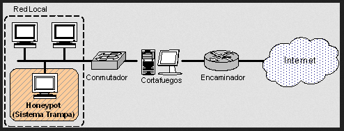 

#### Como funciona el Honeypot ####

Algunos honeypots son programas que se limitan a simular sistemas operativos no existentes en la realidad (son de baja interacción) y son usados fundamentalmente como medida de seguridad. Otros sin embargo trabajan sobre sistemas operativos reales y son capaces de reunir mucha más información. Sus fines suelen ser de investigación (son de alta interacción).

Básicamente un Honeypot tiene como función atraer a los "hackers" para conocer e investigar los comportamientos.

Por ejemplo, supongamos que tenemos un servidor ofreciendo servicios tales como SSH, FTP, WEB, etc.

Con una Honeypot podríamos emular esos servicios en los puertos estándares (22, 21, 80) y distraer a los atacantes para que pierdan el tiempo y de paso ver qué hacen, qué exploits utilizan, si explotan alguna vulnerabilidad nueva, etc.. Esto nos permitirá saber qué servicios atacan y como lo hacen para poder proteger mejor nuestros servidores reales.

## ¿Qué vamos a hacer nosotros? ##

Las pruebas vamos a realizarlas en una RaspBerry Pi, donde tenemos instalada una versión de Linux adaptada para ella y en la cuál podremos instalar el software honeypot que necesitemos. También necesitaremos ser accesibles desde cualquier lugar, por lo que contamos con una IP pública ofrecida por el servicio gratuito No-IP.

Vamos a utilizar el programa __Artillery Honeypot__, que es un honeypot preparado para abrir una serie de puertos que se le indiquen en la configuración. Una vez que esos puertos son atacados añade las IP´s a un archivo para que después podamos analizar de donde provienen y también las bloquea para que no sigan intentando acceder.

Alternativamente también probaremos a habilitar __SSH__ en la RaspBerry Pi para ver si somos atacados por tráfico dirigido a los puertos de SSH.

El honeypot que vamos a usar es de baja interacción, ya que será suficiente para el caso que nos ocupa y es más seguro que los de alta interacción.

La idea es que al realizar las pruebas obtendremos datos suficientes como para poder analizarlos y sacar algo en claro. Concretamente, usando un servicio de geolocalización como __ipinfo.io__ o simplemente usando algún servicio web gratuito podremos ver de donde proceden las IP´s que intenten accedernos y también obtener alguna información más como su organización, región, el hostname... También podremos comprobar en los __logs__ de acceso de nuestra máquina para ir comprobando a qué puerto han intentado acceder, que servicio han usado y cualquier otra información que pueda sernos útil. 

### Abrir SSH ###

Antes de comenzar con las pruebas con honeypots vamos a realizar un pequeño experimento, en la RaspBerry Pi que vamos a usar para las pruebas vamos a instalar y abrir un servicio SSH con el que simularemos un honeypot (de alta interacción) para comprobar si somos atacados.

Lo que nos hemos encontrado ha sido que a los pocos minutos de abrir el servicio SSH hemos detectado varios intentos de acceso a la IP pública de la RaspBerry Pi, podemos ver en la siguiente figura las IP´s de los intentos de acceso:

  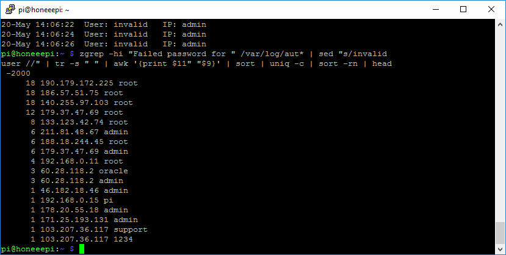 

La mayoría de las IP´s que se muestra son de fuera de nuestra red, son "ataques". Si usamos un servicio online de geolocalización de IP´s vemos que una de las IP´s procede desde Rusia, como se ve en la siguiente figura:

  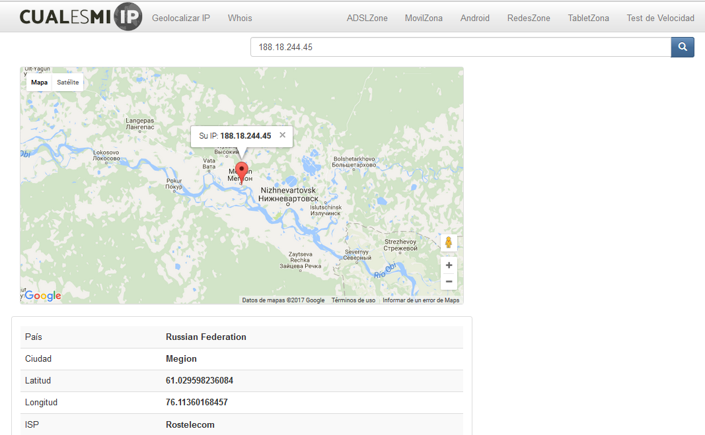 

Y lo mismo pasa con las demás IP´s, muchas de ellas proceden de otros países.

### Artillery ###

Antes de comenzar con las pruebas vamos a mostrar un pequeño tutorial para instalar y configurar el software Artilley Honeypot.

Para todas las siguientes configuraciones es necesario ser usuario root del sistema.

Preparamos el sistema para asegurarnos de que esté actualizado y dispongamos de la herramienta git:

    apt-get update && apt-get install git

Clonamos el directorio de GitHub:

    git clone https://github.com/BinaryDefense/artillery

Entramos la carpeta _/artillery_ y ejecutamos el siguiente scrypt:

    cd /artillery
    ./setup.py

En caso de que nos diera un error con el database podemos solucionarlo de la siguiente forma:

    mkdir /var/artillery/database
    touch /var/artillery/database/temp.database
    service artillery restar

Ahora entraremos en la configuración de Artillery, para ello editamos el archivo de configuración con `nano /var/artillery/config` donde debemos buscar las siguientes variables y asegurarnos de que contengan los siguientes campos:

    MONITOR_FOLDERS=”/var/www”,”/etc”,”/root”
    EXCLUDE=/etc/passwd
    WHITELIST_IP=127.0.0.1,localhost,"demás IP´s locales"
    PORTS="135,445,22,1433,3389,8080,21,5900,25,53,110,1723,1337,10000,5800,44443"

Se recomienda mantener también el programa siempre actualizado (aunque es solo una opción) y proteger ciertos puertos y ataques DoS mediante la siguientes variables:

    AUTO_UPDATE=ON
    ANTI_DOS_PORTS=80,443,8080,8180,10000
    ANTI_DOS=ON

Una vez estemos en este punto estamos listos para ejecutar el programa, que se encargará de recoger las IP´s de los sitios que intenten acceder a esos determinados puertos y los añadirá a una lista en _/var/artillery/banlist.txt_ donde posteriormente podremos recogerlas para analizar desde donde nos han intentado acceder.

Para lanzar Artillery Honeypot basta con ejecutar `sudo service artillery start` y se irán guardando las IP´s registradas.

Una vez que lanzamos el programa podemos confirmas que efectivamente se están abriendo los puertos en la RaspBerry Pi donde lo instalamos, como se ve en la siguiente figura:

  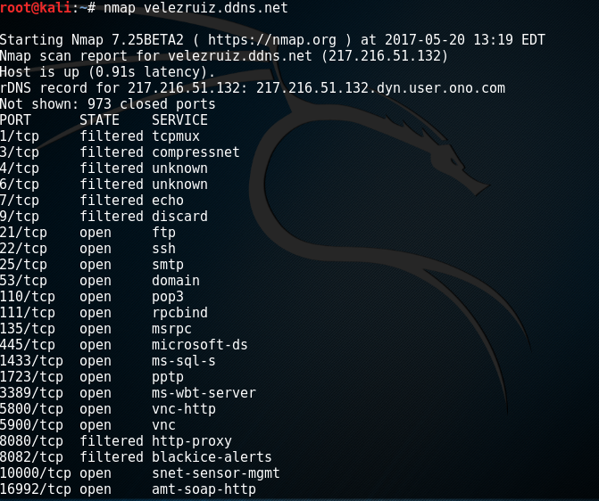 

Y realizando un cat sobre el archivo de IP´s baneadas vemos las que se van añadiendo:

  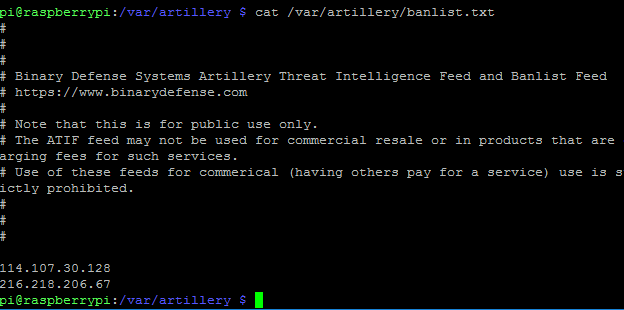 

Una vez que vemos las IP´s que aparecen podemos intentar geolocalizarlas mediante un servicio online para ver desde donde provienen, para ver si ha sido desde dentro de nuestra red o si efectivamente se trata de un intento de acceso desde fuera:

  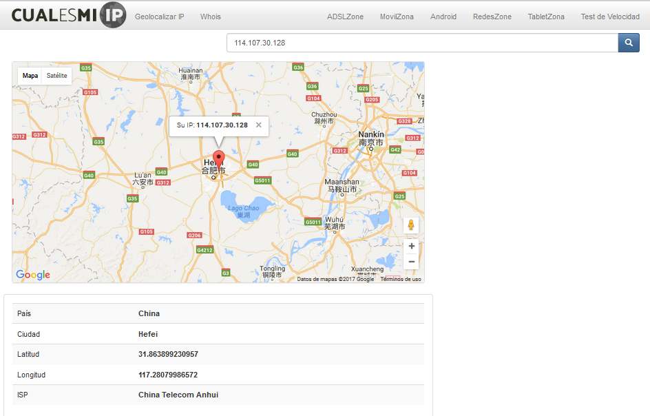 

  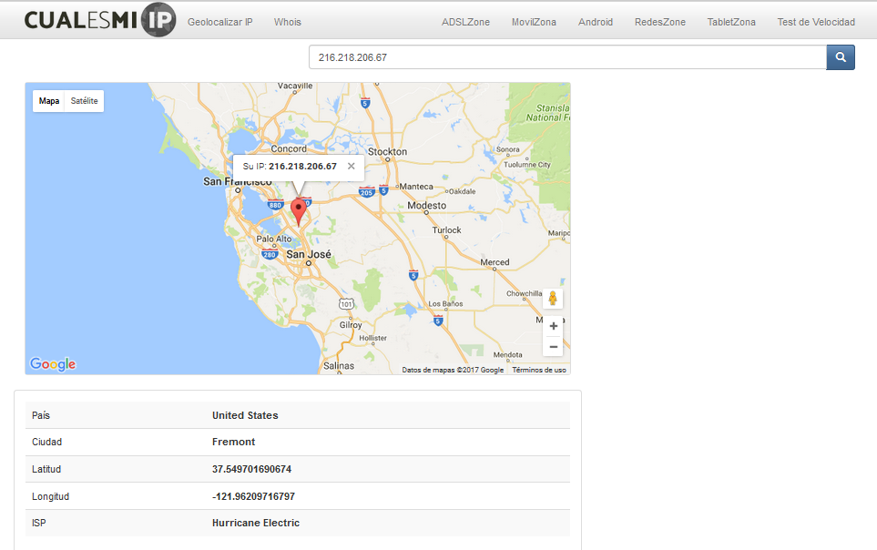 

Estas dos IP´s tardaron pocos minutos en aparecer, y resultaron ser de sitios aparentemente atacantes. Es mas, intentamos hacer _nmap_ a las IP´s y nos dimos cuenta de que una de ellas tiene habilitado el puerto 80, por lo cual accedimos a la IP´s desde el navegador web y vimos que efectivamente se trataba de un sitio aparentemente atacante, como se ve en la siguiente figura:

  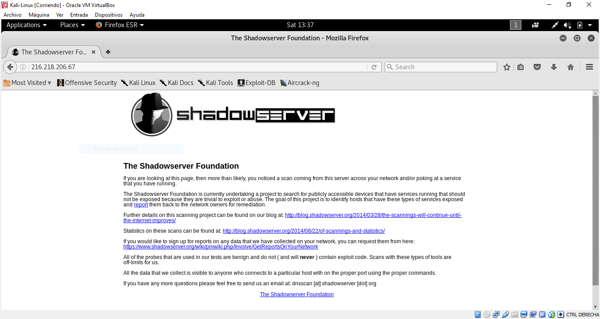 

## Procesar IP´s ##

Una vez que tenemos toda la recopilación de datos de IP´s se nos ocurre que podríamos hacer un script para facilitarnos su tratamiento. Concretamente disponemos de un script que procesa un fichero de datos donde se encuentren las IP´s y nos muestra información sobre ellas en función de los parámetros que le demos.

Para el script hemos hecho uso de la api de ipinfo.io para bash con la que podremos obtener información sobra las IP´s.

- Ni no le damos ninguna opción nos mostrará la información que ofrece ipinfo para cada IP sin más.
- Si usamos la opción -v mostrará para cada IP el país y ciudad de donde procede. En este caso, para el país, en vez de mostrar su CC, lo cotejará con un diccionario y mostrará el nombre del país completo. El diccionario es un fichero txt que acompaña al script.
- Si usamos la opción -m mostrará la información de cada IP de forma que podamos guardar la salida en un fichero csv para posteriormente tratarlo con __My Maps de Google__ y podamos obtener un mapa donde se marquen las procedencias de los intentos de acceso.

El script sería el siguiente:

    #!/bin/bash
    
    CCDATABASE="./cc.txt"
    IPINFOO="ipinfo.io/"
    
    case $# in
    	1)
    		IN="$1"
    		;;
    	2)
    		if [ "$1" = "-v" ]; then
    			IN="$2"
    		fi
    		if [ "$1" = "-m" ]; then
    			IN="$2"
    			echo "IP,Country,Region,Org,Lat,Lon"
    		fi
    		;;
    	*)
    		IN=""
    		;;
    esac
    
    if [ "$IN" = "" ]; then
    	echo "Usage: $0 [OPTIONS] INPUT-IPS"
    	echo "OPTIONS:"
    	echo "  -v: Increase verbosity level"
    	echo "  -m: Data Map version"
    	exit 1
    fi
    
    while read line
    do
    	URL="$line"
    	IPINFO=$(curl $IPINFOO$URL 2>/dev/null)
    	IP=$(echo "$IPINFO" | grep '"ip"' | cut -d'"' -f4)
    	CITY=$(echo "$IPINFO" | grep '"city"' | cut -d'"' -f4)
    	CC=$(echo "$IPINFO" | grep '"country"' | cut -d'"' -f4)
    	REGION=$(echo "$IPINFO" | grep '"region"' | cut -d'"' -f4)
    	ORG=$(echo "$IPINFO" | grep '"org"' | cut -d'"' -f4)
    	LOC=$(echo "$IPINFO" | grep '"loc"' | cut -d'"' -f4)
    	COUNTRY=$(grep -i ":$CC" $CCDATABASE | cut -d':' -f1)
    	case "$1" in
    		"-v")
    			echo "IP: $IP		City: $CITY		Country: $COUNTRY"
    			;;
    		"-m")
    			echo "$IP,$CC,$REGION,$ORG,$LOC"
    			;;
    		*)
    			echo "$IPINFO"
    			;;
    	esac
    done < "$IN"

En la siguiente figura se puede observar el funcionamiento del script. Para que se viese claramente usamos un archivo donde solo había guardadas dos IP´s hasta el momento:

  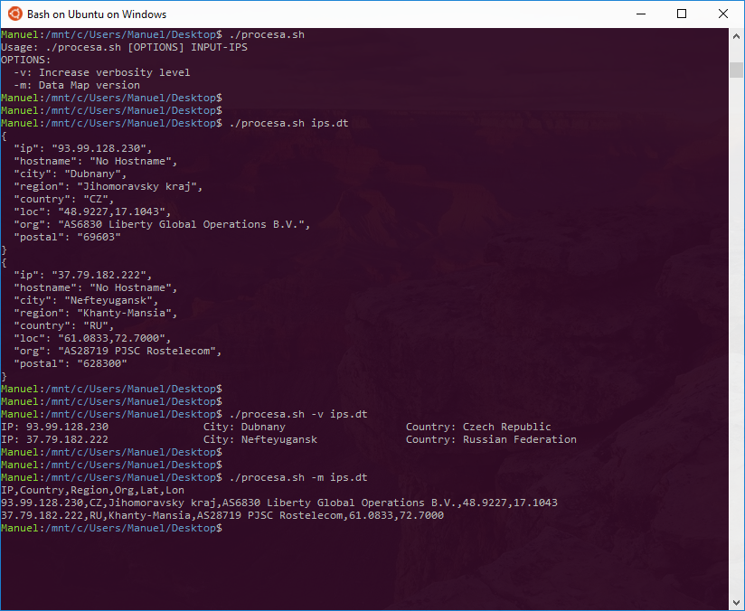 

Tras dejar Artillery funcionando unas horas registramos miles de intentos de acceso. Los procesamos todos con el script para poder guardarlos en un archivo csv y crear un mapa con todos los ataques a través de My Maps de Google, el resultado fue el siguiente:

   

En él podemos observar de forma más global desde donde provienen los intentos de acceso, aunque son tantos los que hemos recibido que se solapan unos con otros. Desde la web, cuando creamos el mapa, podemos acercarnos o alejarnos de forma interactiva a las zonas que más nos interesen, de forma que se vea más claro.

Dejamos algunas capturas con más detalle:

  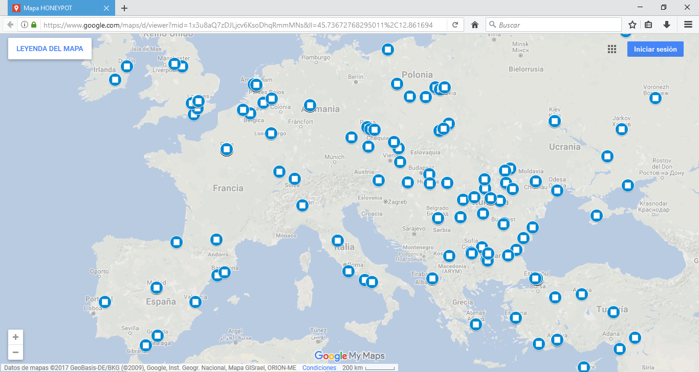 

  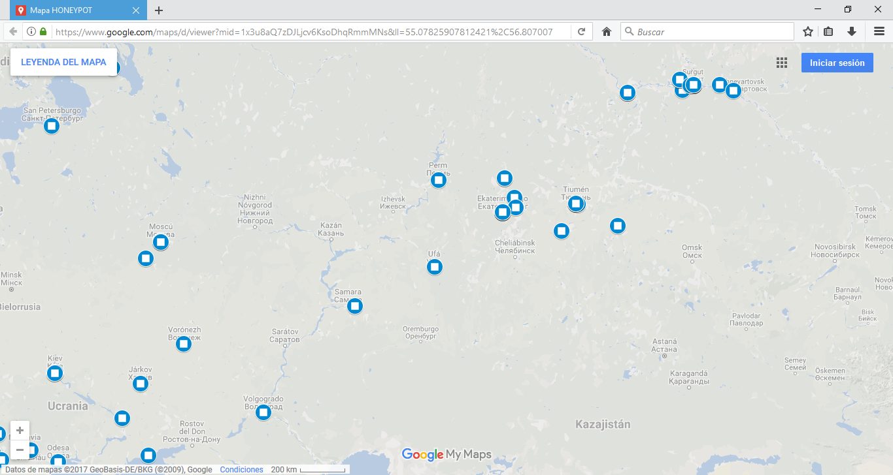 

  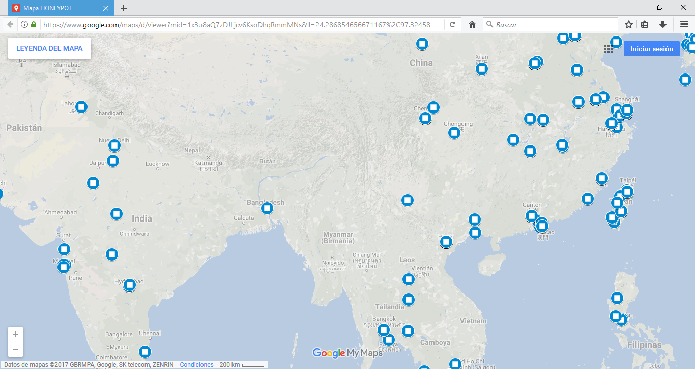 

  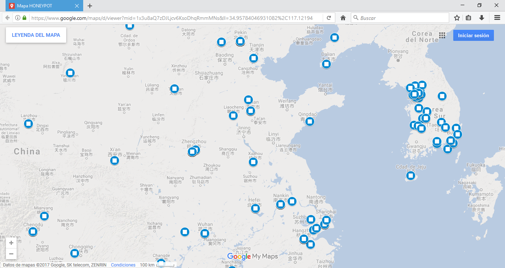 

  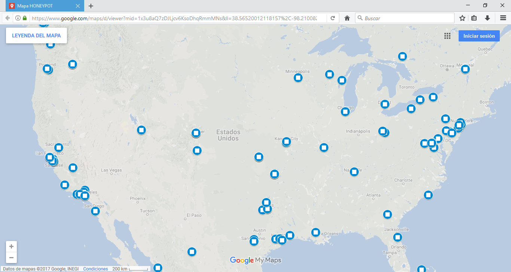 

  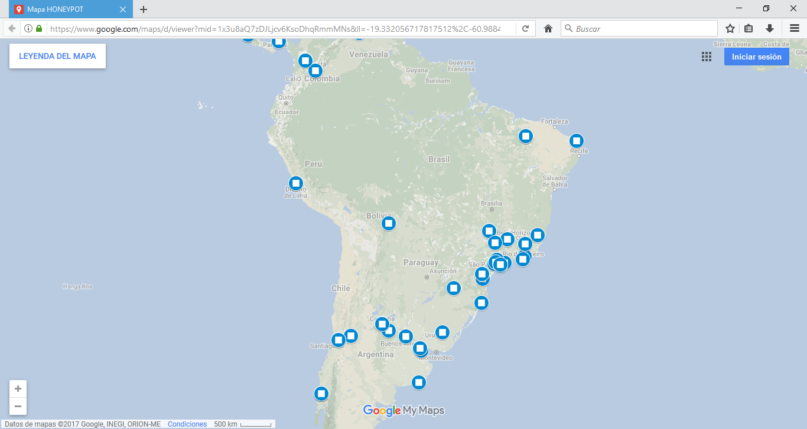 

## Referencias ##
- http://www.rediris.es/cert/doc/pdf/ped-recsi.pdf
- https://web.dit.upm.es/~jlopez/publicaciones/mundointernet04.pdf
- http://www.honeypots.net/honeypots/products
- https://www.projecthoneypot.org/about_us.php
- http://www.security-database.com/toolswatch/PenTBox-v1-1-Beta-Security-Suite.html
- https://www.noip.com/free
- https://www.openssh.com/
- https://www.digitalocean.com/community/tutorials/how-to-set-up-an-artillery-honeypot-on-an-ubuntu-vps
- https://github.com/BinaryDefense/artillery
- https://ipinfo.io/
- https://www.google.com/maps/about/mymaps/