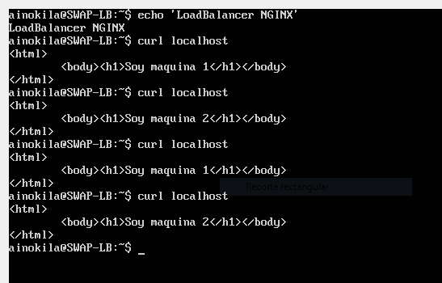
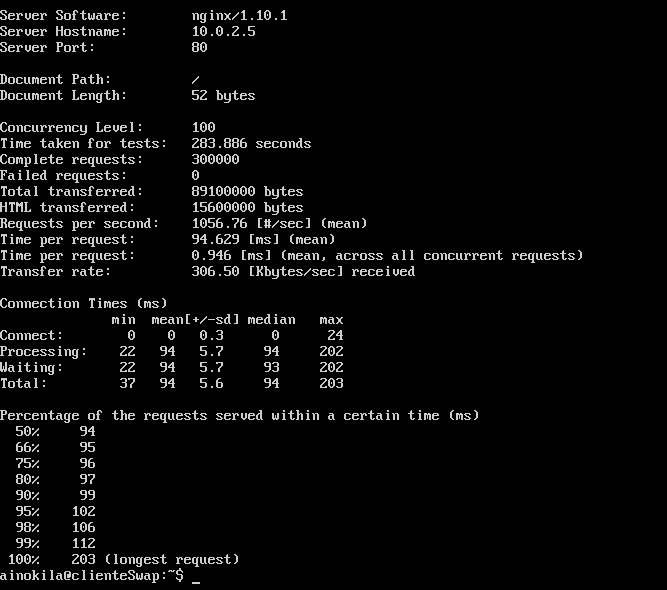
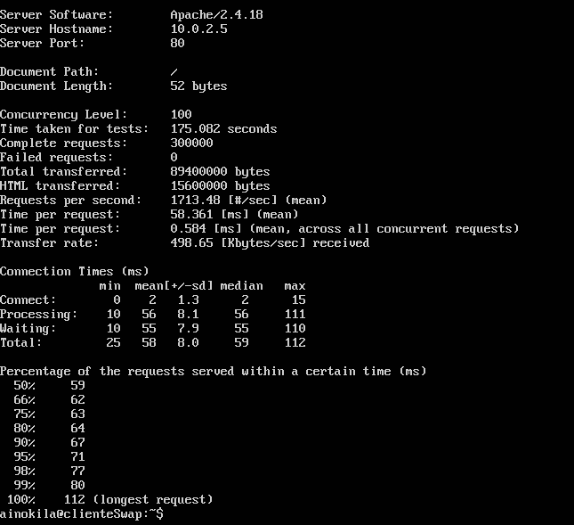

# SWAP2017
## Practica 3

### Conexión de las maquinas

| Maquina 1  | Maquina 2  | Balanceador | Cliente ab  |
| ---------- | ---------- | ----------- | ----------- |
| 10.0.2.4   | 10.0.2.15  |  10.0.2.5   |  10.0.2.7   |

En esta practica voy a instalar dos balanceadores de carga software a nivel http (Nginx y haproxy)

### Nginx

#### Instalación de Nginx

    sudo apt-get install nginx
    sudo systemctl start nginx

#### Configuración de Nginx

Necesitamos configurar Nginx para que realice la distribución de peticiones entre la maquina1 y maquina2, para ello
vamos al archivo /etc/nginx/conf.d/default.conf y lo editamos de la siguiente manera.

    upstream apaches {
     server 10.0.2.4;
     server 10.0.2.15;
    }
    server{
     listen 80;
     server_name balanceador;
     access_log /var/log/nginx/balanceador.access.log;
     error_log /var/log/nginx/balanceador.error.log;
     root /var/www/;
    location /
     {
     proxy_pass http://apaches;
     proxy_set_header Host $host;
     proxy_set_header X-Real-IP $remote_addr;
     proxy_set_header X-Forwarded-For $proxy_add_x_forwarded_for;
     proxy_http_version 1.1;
     proxy_set_header Connection "";
     }
    }

Una vez que se ha guardado, necesitamos que recarge los archivos de configuración.

    sudo service nginx reload

Ya debe estar en funcionamiento.

#### Prueba de Nginx

Realizare la prueba desde el mismo para comprobar si funciona.

    curl localhost

### Haproxy

#### Instalación de haproxy

    sudo apt-get install haproxy

#### Configuración de haproxy

Necesitamos modificar el archivo /etc/haproxy/haproxy.cfg de la siguiente manera.

    global
      daemon
      maxconn 256
    defaults
      mode http
      contimeout 4000
      clitimeout 42000
      srvtimeout 43000
      frontend http-in
      bind *:80
      default_backend servers
    backend servers
      server m1 10.0.2.4:80 maxconn 32
      server m2 10.0.2.15:80 maxconn 32

Una vez que se ha guardado, necesitamos que recarge los archivos de configuración.

      sudo service nginx reload

#### Prueba de haproxy

    curl 10.0.2.5

### Comparación con Apache Benchmark (ab)

#### ab - nginx

Primero voy a realizar el benchmark a nginx, antes de nada debemos parar el servicio haproxy y arrancar nginx.

    sudo service haproxy stop
    sudo service nginx start

Desde el cliente lanzaré ab con una concurrencia de 100 y 300.000 peticiones.

    ab -c 100 -n 300000 http://10.0.2.5/

Esperamos y obtenemos el siguiente resultado.

#### ab - haproxy

Ahora debemos hacer lo contrario, para nginx y arrancar haproxy.

    sudo service nginx stop
    sudo service haproxy start

Desde el cliente lanzaré ab con una concurrencia de 100 y 300.000 peticiones.

    ab -c 100 -n 300000 http://10.0.2.5/

Esperamos y obtenemos el siguiente resultado.

### Conclusión

En mi caso haproxy ha tardado 58,3 ms por peticion y nginx 94,6 ms por petición, por tanto a simple vista parece mas rápido haproxy.
