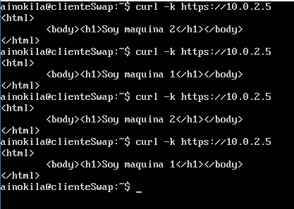
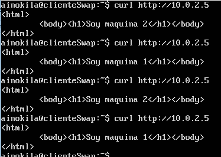

# SWAP2017
## Practica 4

### Conexión de las maquinas

| Maquina 1  | Maquina 2  | Balanceador | Cliente     |
| ---------- | ---------- | ----------- | ----------- |
| 10.0.2.4   | 10.0.2.15  |  10.0.2.5   |  10.0.2.7   |

### Configuración https

#### Creación del certificado en Maquina 1

Tenemos que crear el certificado en una de las maquinas y luego copiarlo a las demás máquinas, para generarlo basta con,

    a2enmod ssl
    service apache2 restart
    mkdir /etc/apache2/ssl
    openssl req -x509 -nodes -days 365 -newkey rsa:2048 -keyout /etc/apache2/ssl/apache.key -out /etc/apache2/ssl/apache.crt

Ahora en el directorio /etc/apache2/ssl tenemos el certificado y la clave (ambas deben copiarse a Maquina2 y Balanceador).

#### Configuración de Apache para ssl

Debemos modificar el archivo /etc/apache2/sites-avalible/default-ssl y añadir las siguientes lineas,

    SSLCertificateFile /etc/apache2/ssl/apache.crt
    SSLCertificateKeyFile /etc/apache2/ssl/apache.key

Una vez realizado, activamos ssl y reiniciamos,

    a2ensite default-ssl
    service apache2 reload

En caso de no tener el certificado en las otras maquinas, lo que haremos sera copiarlo con scp, en mi caso,

    sudo mkdir /etc/apache2/ssl
    sudo scp ainokila@maquina1:/etc/apache2/ssl/ /etc/apache2/ssl

#### Configuración de Nginx para ssl

Debemos ahora configurar ssl en el balanceador, primero debemos copiar el certificado de la maquina1, en /etc/nginx/

    sudo scp ainokila@maquina1:/etc/apache2/ssl/* /etc/nginx

Una vez tenemos el certificado y su clave, debemos configurar nginx para que acepte ssl con ese certificado, para ello vamos al archivo
/etc/nginx/conf.d/default.conf y añadimos las siguientes lineas dentro de server,

    listen 443 ssl;
    ssl_certificate apache.crt;
    ssl_certificate_key apache.key;

Ahora simplemente reiniciamos el servicio y ya funcionará https con ssl.

    sudo service nginx reload

### Configuración iptables en M1 Y M2

En la configuración de las máquinas 1 y 2 debemos permitir su comunicación por el puerto 22,80 y 443 para realizarlo vamos a crear un fichero para su configuración automatica,

    sudo nano /etc/iptables_conf.sh

Una vez abierto añadimos la siguiente configuración,

    #Limpiamos la configuración por defecto
    iptables -F
    iptables -X
    iptables -Z
    iptables -t nat -F

    #Denegamos todo por defecto
    iptables -p INPUT DROP
    iptables -p OUTPUT DROP
    iptables -p FORWARD DROP

    #Permitimos los puertos 22,80 y 443
    iptables -A INPUT -i enp0s3 -p tcp -m multiport --dports 22,80,443 -m state --state NEW,ESTABLISHED -j ACCEPT
    iptables -A OUTPUT -i enp0s3 -p tcp -m multiport --dports 22,80,443 -m state --state ESTABLISHED -j ACCEPT

Una vez realizado se debe programar el script para que se ejecute cada vez que se arranca el sistema, para conseguirlo editamos el fichero de contrab y añadimos,

    @reboot sudo sh /etc/iptables_conf.sh

Ya tendriamos los puertos preparados de ambas máquinas una vez realizado.

### Funcionamiento de la práctica

Para probar el funcionamiento de la práctica probaré https y http con curl,

Como se puede apreciar funcionan perfectamente.
