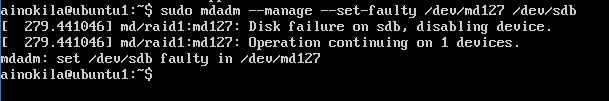
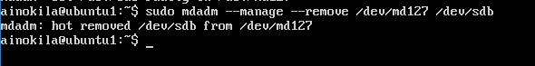
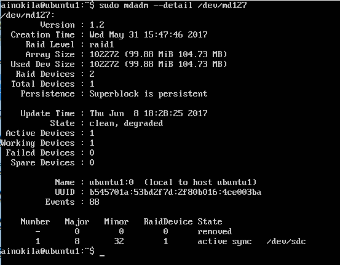
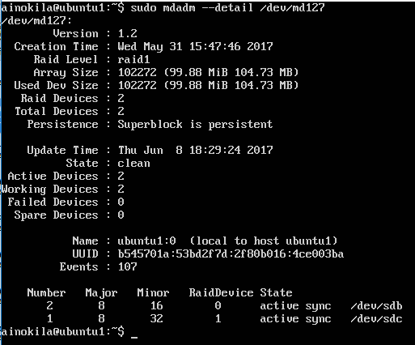

# SWAP2017
## Practica 6

### Creación de los discos duros.

En mi caso he añadido dos discos duros de 100Mb en Virtual Box.

### Instalación de mdadm

En caso de tener que instalar mdadm utilizaremos,

    sudo apt-get install mdadm

En mi caso no ha sido necesario.

### Comprobación de etiquetas de los discos.

Para ver que etiquetas se le ha asignado a los discos usaré,

    sudo fdisk -l 

En mi caso son /dev/sdb y /dev/sdc.

### Creación y formateo del raid

Vamos a proceder a crear un raid con los dos discos que se crearon anteriormente,

    sudo mdadm -C /dev/md127 --level=raid1 --raid-devices=2 /dev/sdb /dev/sdc

Ahora vamos a proceder a formatearlo con,

    sudo mkfs /dev/md127

### Montaje manual del disco

Para montar el disco de manera manual tenemos que crear la carpeta y usar mount,

    sudo mkdir dat
    sudo mount /dev/md127 /dat

Si reiniciamos se perderá el montaje, para ello añadiremos una linea en /etc/fstab.

### Montaje automático

Primero debemos saber cual es el UUID del md127, para ello ejecutaremos,

    ls -l /dev/disk/by-uuid/

Después simplemente vamos editamos el fichero /etc/fstab y añadimos la linea 

    UUID= nuestra UUID /dat ext2 defaults 0 0

Guardamos y ya siempre que arranque estará montado en /dat.

### Simulación de un fallo en disco sdb

Para simular un fallo ejecutaré,

    sudo mdadm --manage --set-faulty /dev/md0 /dev/sdb

Después simplemente lo quitamos,

Como se puede apreciar /dev/sdb ya no esta operativo,

### Añadimos de nuevo el disco

    sudo mdadm --manage --add /dev/md127 /dev/sdb

Como se puede apreciar, vuelve a estar 100% operativo.

ejecutamos mysql -u root, nos pedirá la contraseña, una vez puesta, ya estaremos en la terminal de mysql y debemos poner:

    mysql> create database contactos;
    mysql> use contactos;
    mysql> create table datos(nombre varchar(100),tlf int);
    mysql> insert into datos(nombre,tlf) values ("pepe",95834987);

Una vez realizado, ya tendremos una base de datos llamada contactos con una entrada.

### Replicar una BD MySQL con mysqldump.

Una vez realizada la configuración anterior en la Maquina 1 , se va a proceder a replicar la base de datos a la máquina 2, para ello usaremos mysqldump.

    mysql -u root –p
    mysql> FLUSH TABLES WITH READ LOCK;
    mysql> quit

    mysqldump ejemplodb -u root -p > /tmp/ejemplodb.sql

    mysql -u root –p
    mysql> UNLOCK TABLES;
    mysql> quit

Ya tendremos la copia de seguridad en /tmp/ejemplobd.sql, ahora debemos copiarlo a Máquina 2.

    scp maquina1:/tmp/ejemplodb.sql /tmp/

Una vez que tenemos el fichero en la Maquina 2, realizaremos:

    mysql -u root –p
    mysql> CREATE DATABASE ‘ejemplodb’;
    mysql> quit
    mysql -u root -p ejemplodb < /tmp/ejemplodb.sql

Ya tendremos las bases de datos totalmente replicadas.

### Replicación de BD mediante una configuración maestro-esclavo

Para evitar problemas de automatizacion del paso anterior, vamos a proceder a hacer una configuración maestro esclavo, donde la Máquina 1 será el maestro y la máquina 2 el esclavo.

####Configuración en maquina 1 (Maestro)

File '/etc/mysql/mysql.conf.d/mysqld.cnf':

    #bind-address 127.0.0.1
    log_error = /var/log/mysql/error.log
    server-id = 1
    log_bin = /var/log/mysql/bin.log

Y ahora reiniciamos el servicio.

####Configuración en maquina 2 (Esclavo)

File '/etc/mysql/mysql.conf.d/mysqld.cnf':

    #bind-address 127.0.0.1
    log_error = /var/log/mysql/error.log
    server-id = 2
    log_bin = /var/log/mysql/bin.log
    
Y ahora reiniciamos el servicio.

#### Mysql en Maestro
Ahora debemos ir a la máquina maestro y vamos a crear el esclavo,

    mysql> CREATE USER esclavo IDENTIFIED BY 'esclavo';
    mysql> GRANT REPLICATION SLAVE ON *.* TO 'esclavo'@'%' IDENTIFIED BY 'esclavo';
    mysql> FLUSH PRIVILEGES;
    mysql> FLUSH TABLES;
    mysql> FLUSH TABLES WITH READ LOCK;

#### Mysql en esclavo
Ahora debemos ir a la máquina esclavo y añadimos,

    mysql> CHANGE MASTER TO MASTER_HOST='10.2.0.4',MASTER_USER='esclavo', MASTER_PASSWORD='esclavo',MASTER_LOG_FILE='bin.000002', MASTER_LOG_POS=442, MASTER_PORT=3306;
    mysql> START SLAVE;

Para que el esclavo pueda acceder hay que desbloquear las tablas en el maestro:
    mysql> UNLOCK TABLES;

Una vez realizado mostramos en el esclavo su status y si seconds_behind_master es distinto de null esta funcionando, en mi caso obtengo,

    mysql> SHOW SLAVE STATUS\G

Ahora insertamos unos valores en el maestro y comprobamos si se clonan, en mi caso 1 de ellos no se clona debido a que era el que restaure en el ejercicio anterior.

Como se puede apreciar funcionan perfectamente.
